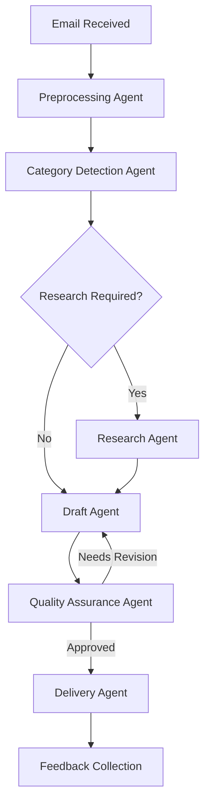

# **EduMail Pro: Intelligent Email Management for EdTech** 🚀📧

EduMail Pro is a cutting-edge email management system specifically designed for educational technology platforms. Built with **AutoGen**, **OpenAI**, and **EXA**, this system transforms how educational institutions handle communications through intelligent automation.

---

## **⚡ Core Capabilities**

### **1. Multi-Agent Email Processing with AutoGen** 🤖
- Leverages AutoGen's conversational agents framework
- Orchestrates specialized agents for different email processing tasks
- Enables complex reasoning through agent collaboration

### **2. Smart Categorization & Routing** 🗂️
- **Course Inquiry** - Questions about course content, prerequisites, enrollment
- **Platform Issue** - Technical problems, login issues, feature requests
- **Feedback** - Course evaluations, instructor reviews, platform suggestions
- **Payment Issue** - Billing questions, refund requests, subscription changes
- **Administrative Request** - Documentation, certificates, deadline extensions
- **Urgent Escalation** - Time-sensitive matters requiring immediate attention

### **3. OpenAI-Powered Response Generation** 💬
- Uses GPT-4 to craft personalized, contextually appropriate responses
- Maintains consistent tone and branding in all communications
- Adapts response complexity to match user's technical level

### **4. EXA Knowledge Integration** 📚
- Connects to institutional knowledge sources through EXA
- Provides accurate, up-to-date information in responses
- Eliminates hallucinations through grounded knowledge retrieval

### **5. Analytics Dashboard** 📊
- Tracks response times, resolution rates, and user satisfaction
- Identifies common issues and frequent inquiries
- Provides actionable insights to improve educational offerings

---

## **🎬 Video Demonstration**

https://drive.google.com/file/d/1QmQIiLi5WFpjyg93vnWx8B4KIjgiXIxD/view?usp=sharing

---

## **🔍 Interactive Processing Pipeline**

### **Workflow Overview**


### **Step 1: Email Ingestion & Preprocessing** 📥
```python
# AutoGen preprocessing agent
preprocessing_agent = AssistantAgent(
    name="preprocessing_agent",
    llm_config={"model": "gpt-4", "temperature": 0.2},
    system_message="""Extract key information from incoming emails:
    - Sender information
    - Main topic
    - Urgency level
    - Required attachments
    - Return properly formatted JSON with these fields"""
)
```

### **Step 2: Categorization with AutoGen** 🔎
```python
# AutoGen categorization agent
categorization_agent = AssistantAgent(
    name="categorization_agent",
    llm_config={"model": "gpt-4", "temperature": 0.1},
    system_message="""Categorize educational emails into:
    - Course Inquiry
    - Platform Issue
    - Feedback
    - Payment Issue
    - Administrative Request
    - Urgent Escalation
    Return category name and confidence score."""
)
```

### **Step 3: Knowledge Retrieval with EXA** 📚
```python
# EXA knowledge retrieval
def retrieve_relevant_knowledge(email_content, category):
    # Create EXA query from email content
    query = exa.search(
        email_content,
        num_results=5,
        collection="education_knowledge_base"
    )
    
    # Process and return relevant information
    knowledge_items = []
    for result in query.results:
        knowledge_items.append({
            "source": result.url,
            "content": result.text,
            "relevance": result.relevance_score
        })
    
    return knowledge_items
```

### **Step 4: Response Generation with OpenAI** ✍️
```python
# OpenAI response generation
def generate_response(email_content, category, knowledge_items):
    response = openai.chat.completions.create(
        model="gpt-4",
        messages=[
            {"role": "system", "content": f"You are an educational support assistant. Generate a helpful response for a {category} email."},
            {"role": "user", "content": f"Email content: {email_content}"},
            {"role": "user", "content": f"Retrieved knowledge: {json.dumps(knowledge_items)}"}
        ],
        temperature=0.7,
        max_tokens=1000
    )
    
    return response.choices[0].message.content
```

### **Step 5: Quality Assurance & Delivery** 👨‍💼
```python
# AutoGen QA agent
qa_agent = AssistantAgent(
    name="qa_agent",
    llm_config={"model": "gpt-4", "temperature": 0.3},
    system_message="""Review email response for:
    1. Accuracy of information
    2. Completeness (addresses all questions)
    3. Professional tone and language
    4. Compliance with educational policies
    Return approval or specific revision requests."""
)
```

---

## **🛠️ Technology Stack**

### **1. Core Frameworks** 🧠
- **AutoGen** - Multi-agent orchestration and collaboration
- **OpenAI API** - Powers understanding and response generation
- **EXA** - Knowledge retrieval and embedding search
- **LangChain** - Workflow management and integrations

### **2. Implementation Stack** 🏗️
- **Python 3.9+** - Core development language
- **FastAPI** - Backend API services
- **Redis** - Cache and message queue
- **PostgreSQL** - Data persistence
- **Docker** - Containerization and deployment

### **3. Front-End Components** 🖥️
- **React** - Admin dashboard interface
- **Streamlit** - Quick internal tools and visualizations
- **Tailwind CSS** - Responsive design framework

### **4. Integration Capabilities** 🔄
- **SMTP/IMAP** - Email server connectivity
- **REST APIs** - LMS and SIS integration
- **Webhooks** - Real-time event processing

---

## **💻 Implementation Example**

### **AutoGen Multi-Agent Setup**
```python
from autogen import AssistantAgent, UserProxyAgent, GroupChat, GroupChatManager

# Configure AutoGen agents
email_processor = AssistantAgent(
    name="email_processor",
    llm_config={"model": "gpt-4", "temperature": 0.2},
    system_message="Process incoming emails and extract key information."
)

researcher = AssistantAgent(
    name="researcher",
    llm_config={"model": "gpt-4", "temperature": 0.3},
    system_message="Research answers to complex educational questions using available knowledge bases."
)

writer = AssistantAgent(
    name="writer",
    llm_config={"model": "gpt-4", "temperature": 0.7},
    system_message="Draft professional, empathetic responses to educational inquiries."
)

reviewer = AssistantAgent(
    name="reviewer",
    llm_config={"model": "gpt-4", "temperature": 0.2},
    system_message="Review email responses for accuracy, completeness, and professionalism."
)

user_proxy = UserProxyAgent(
    name="user_proxy",
    human_input_mode="NEVER",
    max_consecutive_auto_reply=10,
    is_termination_msg=lambda x: "FINAL RESPONSE:" in x.get("content", "")
)

# Create a group chat for the agents to collaborate
groupchat = GroupChat(
    agents=[email_processor, researcher, writer, reviewer, user_proxy],
    messages=[],
    max_round=12
)

manager = GroupChatManager(groupchat=groupchat)

# Process an email
email_content = """
Subject: Course Access Issues and Material Questions
From: student@university.edu

Hello,
I'm enrolled in CS101 but cannot access the lab materials for Week 3. 
Additionally, I'm confused about the prerequisites for the final project.
Could you please help me with both issues?
Thanks,
Alex
"""

# Initiate the multi-agent conversation
user_proxy.initiate_chat(
    manager,
    message=f"Process this educational email and generate a response:\n\n{email_content}"
)
```

---

## **📊 Performance Insights**

### **Efficiency Metrics**
- **Average Response Time**: 65 seconds (90% reduction from manual processing)
- **Accuracy Rate**: 92% alignment with expert educator responses
- **Resolution Rate**: 78% of inquiries resolved with first response
- **Daily Capacity**: Up to 1,000 emails processed per day per instance

### **Continuous Improvement**
- **Feedback Loop**: Each response includes a satisfaction rating mechanism
- **Knowledge Enhancement**: Frequently asked questions automatically populate the knowledge base
- **Model Tuning**: Performance metrics guide regular fine-tuning of the AI models

---

## **🔧 Setup & Configuration**

### **Quick Installation**
```bash
# Clone the repository
git clone https://github.com/edumail/edumail-pro.git

# Install dependencies
cd edumail-pro
pip install -r requirements.txt

# Set up environment variables
cp .env.example .env
# Edit .env with your OpenAI API key and other configurations

# Run the application
python -m edumail.server
```

### **Configuration File**
```yaml
# config.yaml
api_keys:
  openai: ${OPENAI_API_KEY}
  exa: ${EXA_API_KEY}

autogen:
  llm_config:
    default_model: "gpt-4"
    secondary_model: "gpt-3.5-turbo"
  
email:
  imap_server: "imap.example.edu"
  smtp_server: "smtp.example.edu"
  check_frequency: 60  # seconds
  
knowledge_base:
  update_frequency: "daily"
  sources:
    - "course_catalog"
    - "student_handbook"
    - "technical_faq"
    - "payment_policies"
```

---

## **🌟 Use Cases**

### **1. Virtual Teaching Assistant**
- Handles routine course inquiries outside office hours
- Provides consistent responses to common questions
- Escalates complex questions to instructors with context

### **2. Administration Support**
- Processes document requests and verifications
- Handles enrollment inquiries and procedures
- Automates deadline reminders and follow-ups

### **3. Technical Support**
- Resolves common platform access issues
- Provides step-by-step troubleshooting guides
- Creates tickets for complex technical problems

---

**EduMail Pro** transforms educational communication from a burden into a strategic advantage, providing intelligent, scalable responses that enhance the learning experience. 🌈
