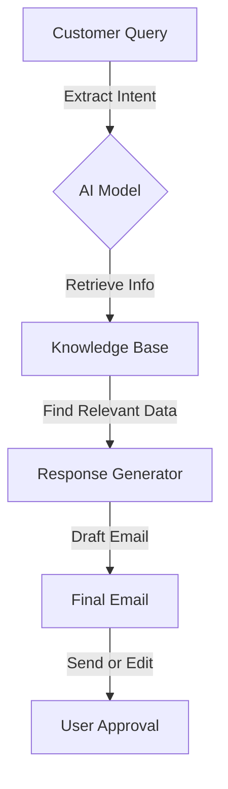

# 📩 AI Email Assistant – Smart Email Management with AI  

Effortlessly generate **accurate, context-aware email responses** using your company's **knowledge base**! 📄✉️  

🔗 **Deployed Link:** [Click here to try it out](https://edumail-jdfkd3fkaawzsnqxtjyftl.streamlit.app/)  

---

## ✨ Key Features  
✅ **Contextual Understanding** – Uses **brochures, FAQs, and company docs** as a knowledge base 📚  
✅ **AI-Powered Email Drafting** – Generates **professional & relevant responses** ✍️  
✅ **Fast & Accurate** – Ensures **AI-generated replies** match customer inquiries intelligently ⚡  
✅ **Customizable** – Fine-tune **tone and style** based on business needs 🎨  
✅ **Easy Integration** – Seamlessly connects with **CRM, email services, chatbots** 🔗  

---

  

---

## 🛠 How It Works  



1️⃣ **Customer Query** – AI understands the intent of the incoming question 🤔  
2️⃣ **Knowledge Retrieval** – Searches through **company documents, brochures, FAQs** 📚  
3️⃣ **Response Generation** – AI drafts a **professional email** 💡  
4️⃣ **User Review** – **Edit & customize** before sending ✍️  
5️⃣ **Send & Automate** – Email is **sent or integrated** with CRM/email service 📩  

---

## 🚀 Getting Started  

### 📌 Installation  
```bash
git clone https://github.com/Zoyaaaaaaa/Edumail.git  

```  

### 🐳 Docker Setup  
Easily deploy using Docker:  
```bash
docker build -t ai-email-assistant .  
docker run -p 3000:3000 ai-email-assistant  
```

---

## 🎯 Use Cases  
✔ **Customer Support Teams** – Quickly respond to frequent inquiries 🏢  
✔ **Sales & Marketing** – Craft **personalized responses** for leads 📈  
✔ **Product Support** – Explain **product features & troubleshooting** 🔧  
✔ **Automated Chatbots** – Power AI-driven **customer service bots** 🤖  

---

## 🛣 Roadmap  
🔹 **Multi-language Support 🌍** – Generate emails in multiple languages  
🔹 **Advanced Personalization 🎯** – AI adapts responses based on customer profile  

---

## 💡 Why Use This?  
✅ **Saves Time** – No more **manual email drafting** ⏳  
✅ **Consistent Replies** – Ensures **accurate & on-brand** responses 📢  
✅ **Boosts Productivity** – Frees up **customer support agents** 💼  
✅ **Scalable Solution** – Handles **multiple queries** at once 🚀  

---

## 🌍 Deployed Link  
🎯 **Try it out here:** [Deployed Link](https://edumail-jdfkd3fkaawzsnqxtjyftl.streamlit.app/)   

---

## 🤝 Contributing  
We welcome contributions! Feel free to open an **issue** or submit a **pull request**.  

📧 **Contact:** [zoyah015@example.com](mailto:zoyah015@example.com)  

